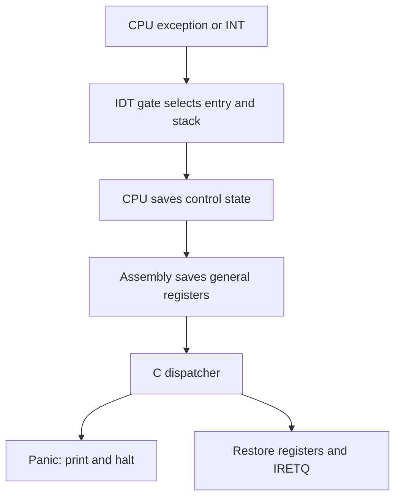

# Phase 3 — CPU architecture initialization

Phase 2 is complete. This phase adds CPU descriptor tables and diagnostic
exception handling to the existing higher-half x86-64 C/NASM kernel. It does
not start Phase 4. Limine still boots the kernel; our terminal and formatter
remain the output path.

## What changes when you boot?

The Phase 2 output remains. After it, the kernel installs its CPU tables, takes
an intentional breakpoint, returns with its original register state, and takes
and returns from a software interrupt. Normal boot ends with:

```text
GDT/TSS loaded. IDT: 256 gates installed.
PIC remapped: IRQs masked; IF=0.
Breakpoint: resumed safely.
Phase 3 register preservation: OK
Software interrupt 0x80: returned safely.
Phase 3 CPU initialization complete.
```

The CPU then halts in the existing assembly loop. There is still no keyboard
input or shell. IRQs remain disabled. Deliberate fault modes instead produce a
red panic screen and halt. Their addresses depend on the build.

## The concepts and our decisions

| Component | Purpose in this implementation |
|---|---|
| GDT | Defines ring-0 code/data descriptors and locates our TSS. |
| TSS | Holds stack pointers; IST1 for double fault, IST2 for NMI, IST3 for machine check. |
| IDT | Holds 256 descriptors mapping event vectors to assembly entry points. |
| Assembly stubs | Normalize error codes and save all 15 general registers. |
| C dispatcher | Routes exceptions, software interrupts, and the PIC IRQ range. |
| Panic handler | Prints the interrupted CPU state and halts. |
| PIC | Remaps IRQ0–15 to vectors 32–47 and masks every hardware IRQ. |

**GDT versus paging:** Long mode largely ignores ordinary segment bases and
limits, but still needs code attributes, privilege checks, valid selectors,
and a TSS descriptor. The GDT does not allocate physical pages or replace
paging. We retain Limine's mappings until the memory phases.

**Why a TSS now?** An ordinary handler uses the interrupted stack. If that
stack is broken, merely entering the handler can fail. An Interrupt Stack
Table entry lets the CPU switch to a reserved stack before saving state.
Three separate 16 KiB static stacks make #DF, NMI and #MC independent of the
normal bootstrap stack. Static storage is appropriate before an allocator
exists. These stacks do not yet have guard pages, and this is not a guarantee
of surviving every corruption. The single TSS is for the bootstrap CPU only.

**Interrupt gates versus trap gates:** Both describe event entry points.
An interrupt gate clears IF during entry; a trap gate preserves IF. We use
interrupt gates (0x8E) everywhere to keep the first implementation simple.
IRETQ restores the saved flags. All gates have DPL=0. Ring 3 access and
syscalls belong to later phases; vector 0x80 here is only a kernel test.

**Exceptions versus IRQs:** A divide instruction with zero divisor generates
#DE even with IF=0. Hardware IRQ delivery is controlled by interrupt routing,
masking and IF. CLI does not block exceptions, INT instructions, or NMIs.
A breakpoint is a trap: its saved RIP points after INT3. Divide error and
invalid opcode are faults: their saved RIP identifies the faulting instruction.
Returning unchanged from a divide fault would repeat it, so we panic instead.
Only our breakpoint handler resumes an exception in this phase.

**PIC versus APIC:** The legacy pair of 8259 PICs is simple and has 16 IRQ
inputs (one used for cascade). The local APIC is per CPU; an I/O APIC routes
external interrupts and supports multicore routing more flexibly. APIC setup
needs discovery and routing work we do not need yet. For this QEMU q35 phase
we initialize and fully mask the PIC, without configuring or enabling APIC
interrupt sources. Phase 7 will add real device interrupt delivery. A software
INT is not proof that a physical timer or keyboard IRQ works.

## How an exception reaches C



The CPU's long-mode frame contains SS, old RSP, RFLAGS, CS and RIP, plus an
error code for certain exceptions. SS/RSP are present even for same-privilege
64-bit entry. Our stubs add a zero when the CPU does not supply an error code,
then add the vector. They push the remaining registers in a fixed order.

| Byte offset from `struct interrupt_frame *` | Content |
|---|---|
| 0–56 | R15, R14, R13, R12, R11, R10, R9, R8 |
| 64–112 | RBP, RDI, RSI, RDX, RCX, RBX, RAX |
| 120 | Vector |
| 128 | Error code, real or synthetic zero |
| 136 | RIP |
| 144 | CS |
| 152 | RFLAGS |
| 160 | Interrupted RSP |
| 168 | SS |

The compile-time assertions catch accidental C layout changes. The assembly
and C layout must remain synchronized. Registers use 64-bit fields even when
a selector or vector needs fewer bits because each stack slot is eight bytes.

## Reading the important instructions

In `gdt_load.asm`:

- `lgdt [rdi]` loads the table address and byte limit from the C argument.
- Pushing selector 0x08 and a return address followed by `retfq` reloads CS.
  Loading GDTR alone does not refresh cached segment descriptors.
- Loading 0x10 into DS/ES/SS selects our writable kernel data descriptor.
- `ltr ax` loads selector 0x18, locating the 104-byte TSS. Its descriptor spans
  two GDT slots because a 64-bit TSS base needs more address bits.

In `isr_stubs.asm`:

- The macro emits a distinct label for each of 256 vectors.
- Exceptions 8, 10–14, 17, 21, 29 and 30 already push an error code. Adding
  another zero for them would shift every subsequent field and break IRETQ.
- All GPRs are pushed before C can clobber caller-saved registers.
- `cld` satisfies the C ABI. The original direction flag remains in RFLAGS.
- `mov rdi, rsp` passes a pointer to the saved frame.
- `mov rbx, rsp` preserves the frame base in a C callee-saved register.
- `and rsp, -16` aligns the call stack. The saved frame remains untouched.
- After C returns, pops restore every saved GPR, including original RBX.
- `add rsp, 16` removes only our vector/error pair.
- `iretq` restores the CPU's return frame. A normal `ret` cannot do this.

The compiler already uses `-mno-red-zone`: asynchronous entry must not destroy
compiler data below the stack pointer. SIMD/x87 remain disabled in kernel
code, so this phase does not need floating-point state saving. This stub is
for the current ring-0, single-core kernel, not a complete future userspace
entry path (no SWAPGS/TLS/FPU context handling yet).

In `pic.c`, ICW1–4 initialize both chips, set their vector bases, describe the
cascade connection, and choose 8086 mode. Final masks of 0xFF block all lines.
Real slave IRQs require EOI to the slave, then the master. Spurious IRQ7 gets
no EOI; spurious IRQ15 gets a master-only EOI. `irq_register()` installs a
callback only with IF=0 and does not unmask the line. Device callbacks should
be short and nonblocking when drivers are added.

In `panic.c`, CR2 is sampled at entry for page-fault diagnostics, then the
existing terminal is cleared and the register dump is printed using kprintf.
A single-core recursion guard falls back to serial output if panic itself
faults. Fatal exceptions never return. Page faults can be reported here, but
page mapping and recovery are still Phase 5 work.

## Files

New implementation files:

- `include/axiom/arch/gdt.h`
- `include/axiom/arch/interrupts.h`
- `include/axiom/arch/pic.h`
- `arch/x86_64/cpu/gdt.c`
- `arch/x86_64/cpu/gdt_load.asm`
- `arch/x86_64/cpu/selftest.c`
- `arch/x86_64/cpu/register_probe.asm`
- `arch/x86_64/interrupts/idt.c`
- `arch/x86_64/interrupts/isr_stubs.asm`
- `arch/x86_64/interrupts/pic.c`
- `kernel/core/panic.c`
- `tests/phase3_cpu.py`

Modified implementation files: `Makefile`, `arch/x86_64/boot/entry.asm`, and
`kernel/core/kernel.c`. The boot stub now explicitly clears DF and exports its
stack-top symbol. The kernel invokes Phase 3 after the existing terminal demo.
The Makefile adds separate test build directories and C header dependencies.
`docs/phase3-complete-source.md` contains the complete text of every new or
modified implementation file, not patches or excerpts.

## Build and run on your Steam Deck

Enter the existing container from Konsole:

```bash
distrobox enter axiom-dev
```

For a first try without changing your original working directory, save the
updated ZIP as `~/Downloads/AxiomOS.zip` and extract it into a new directory:

```bash
mkdir -p ~/AxiomOS-phase3
unzip ~/Downloads/AxiomOS.zip -d ~/AxiomOS-phase3
cd ~/AxiomOS-phase3/AxiomOS
make clean
make
make run
```

If your browser changed the ZIP filename, substitute its actual name. The
archive includes the original Git metadata; extraction into a new directory
keeps your original checkout untouched. No commit has been created for you.

Your existing compiler dependencies should already be available. For a fresh
Ubuntu container only, the development packages are:

```bash
sudo apt update
sudo apt install clang lld llvm nasm make qemu-system-x86 xorriso gdb python3 unzip
```

The packaged Limine files are retained at v12.9.0. If an archive extraction
loses their executable permission, use `chmod +x third_party/limine/limine`.
Do not run `make distclean` just to build: that removes Limine and forces a
fresh network download.

Run the regression suite:

```bash
make test
```

Run only the new CPU suite:

```bash
make test-phase3
```

Inspect the deliberate panics interactively, one QEMU window at a time:

```bash
make MODE=divide run
make MODE=invalid run
make MODE=gp run
make MODE=double_fault run
```

Close QEMU between commands. A frozen panic screen is the expected outcome.
Use `make run` again for normal boot; no edit or clean is needed to switch.

## What each test proves

1. Normal boot: all Phase 2 markers survive; an assembly probe seeds all 15
   GPRs, records RSP and RFLAGS, sets DF, executes INT3, and checks them after
   return. A software INT 0x80 then exercises the non-exception dispatch path.
2. Divide: a real `div rcx` with RCX=0 raises #DE; C division by zero would be
   undefined behavior and is deliberately avoided.
3. Invalid opcode: `ud2` produces #UD deterministically.
4. General protection: loading DS with selector 0x38 (outside the current seven-slot GDT) raises
   #GP with hardware error code 0x38. This checks the error-code frame path. (At the original Phase-3 milestone, 0x28 was outside the smaller GDT; Phase 9 now uses 0x28 for the TSS.)
5. Double fault: test-only code makes the #GP gate non-present, then triggers
   #GP. Delivery fails with #NP, producing a genuine #DF. The handler checks
   that its frame lies inside the dedicated IST1 stack.

The Python test inspects actual serial output, exception name, vector, error,
all reported GPRs, segment selectors, RFLAGS and stack range. For #DE/#UD/#GP
it compares the saved RIP against the fault-instruction symbol in that mode's
ELF using llvm-nm. Divide operands must match their known values. No silent
hang is accepted as success. Each boot has a 20-second timeout and logs.

## Debugging

Use matching mode symbols: an address from a fault-mode ELF must not be
interpreted with the normal ELF. For an invalid-opcode session:

Terminal 1, inside the project:

```bash
make MODE=invalid debug
```

Terminal 2, in the same container and directory:

```bash
gdb build-invalid/AxiomOS.elf
```

Inside GDB:

```gdb
target remote localhost:1234
hbreak interrupt_dispatch
continue
p *frame
info registers
x/22gx $rdi
continue
```

The first stop is the intentional breakpoint test, then the software INT,
then the fatal exception. At the exact function-entry breakpoint, RDI is the
frame pointer. Optimized C can make `frame` unavailable; use:

```gdb
p *(struct interrupt_frame *)$rdi
```

To stop directly at the invalid instruction, start a fresh debug session:

```gdb
hbreak phase3_invalid_fault
continue
x/i $rip
si
```

If no Phase 3 banner appears, break at `gdt_init`, `gdt_load` and
`interrupts_init` to find the failing transition. `monitor info registers`
shows GDTR, IDTR and TR in QEMU. If the CPU resets or stops without panic,
log the CPU events with:

```bash
qemu-system-x86_64 -machine q35 -m 256M -cdrom build/AxiomOS.iso \
  -boot d -serial stdio -monitor none -no-reboot -no-shutdown \
  -d int,cpu_reset -D build/cpu-events.log
```

Check selector 0x08, the IDT offset fields, the 16-byte gate size, the TSS
limit/base and IST pointers, and whether an extra error-code slot shifted
the frame. Triple faults generally mean exception delivery itself failed.
QEMU logs include firmware events too; focus on the kernel address range.

If a test fails, inspect that mode's `phase3-build.log`, `phase3-serial.log`
and `phase3-qemu.log` in `build`, `build-divide`, `build-invalid`, `build-gp`,
or `build-double_fault`. This phase is not complete on your machine until
`make test` passes and you can see normal boot and a panic in QEMU.

## Suggested milestone commit

After your tests pass, from your chosen working checkout:

```bash
git add Makefile arch include kernel tests docs README.md .gitignore
git commit -m "feat: initialize CPU tables and handle kernel exceptions"
```

## Interview practice (answer in your own words)

1. Why do we still need a GDT in 64-bit mode?
2. Why doesn't CLI prevent a divide-by-zero exception?
3. Why can INT3 return without editing RIP, while a divide fault cannot?
4. What would break if we pushed a synthetic error code for #GP?
5. Why does a double-fault handler need an independent stack?
6. What does our software interrupt test fail to prove about hardware IRQs?

## Reference and scope

The architectural reference is the Intel SDM, Volume 3A: descriptor tables,
64-bit interrupt/exception handling, TSS/IST, and APIC fundamentals:
[Intel Software Developer Manuals](https://www.intel.com/content/www/us/en/developer/articles/technical/intel-sdm.html)

The implementation is original project code, not imported Linux or hobby-OS
handler code. No allocator, scheduler, userspace, APIC driver, device input,
filesystem, or networking was implemented in this phase.
